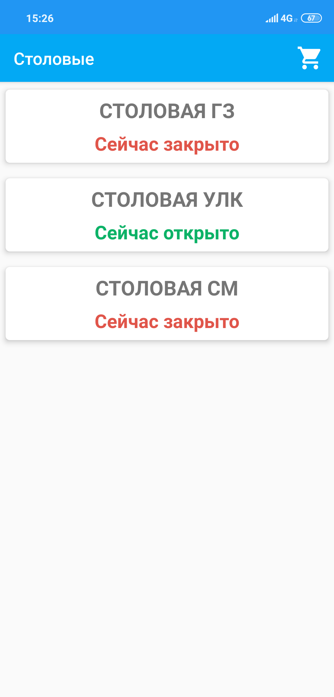
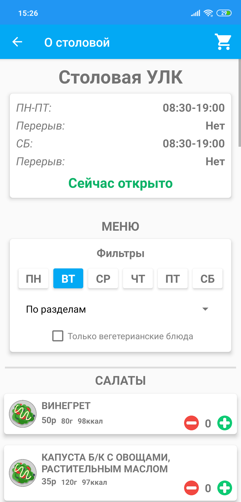
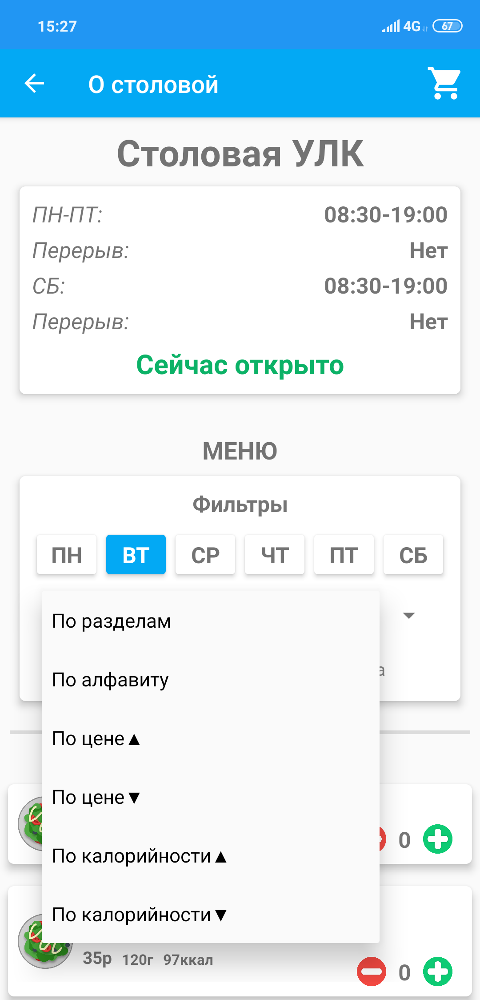
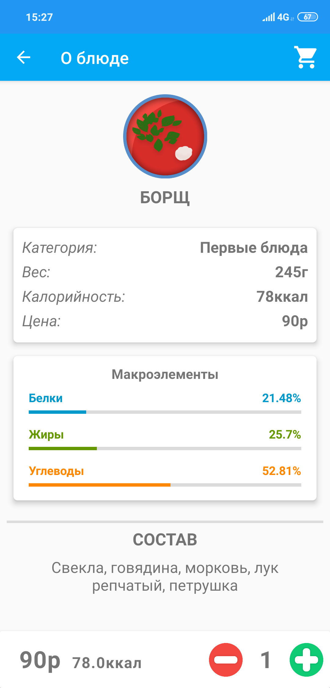
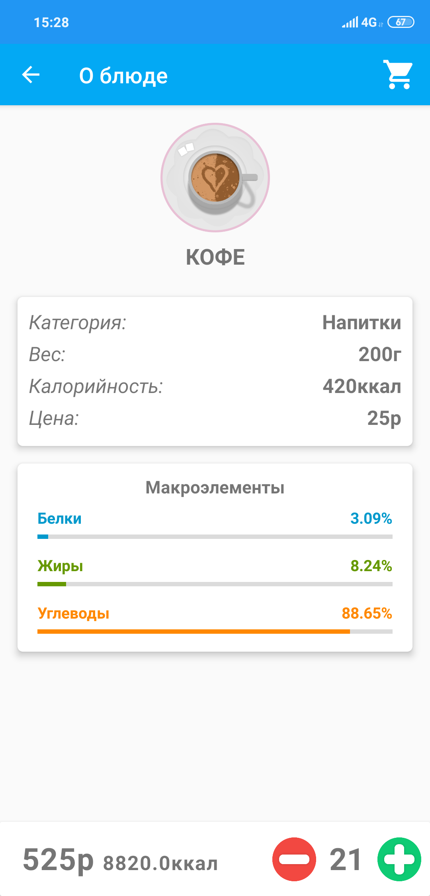
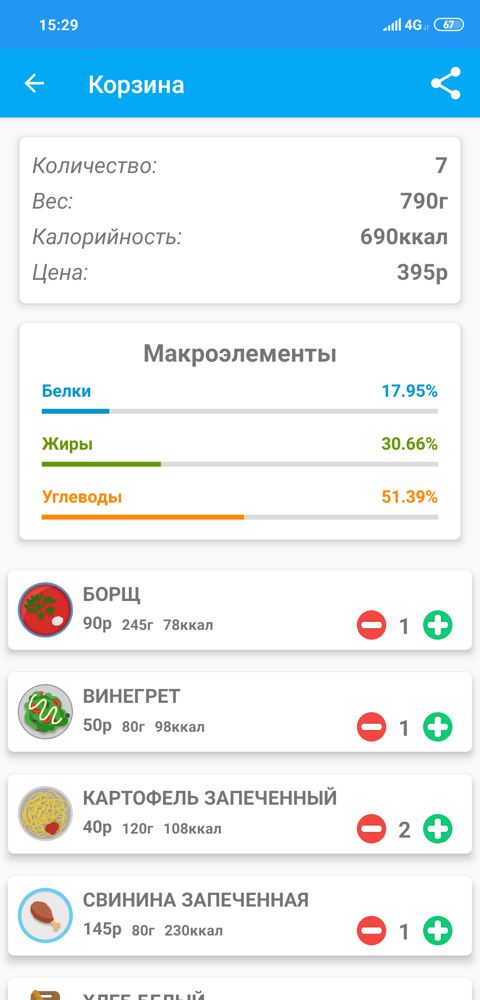
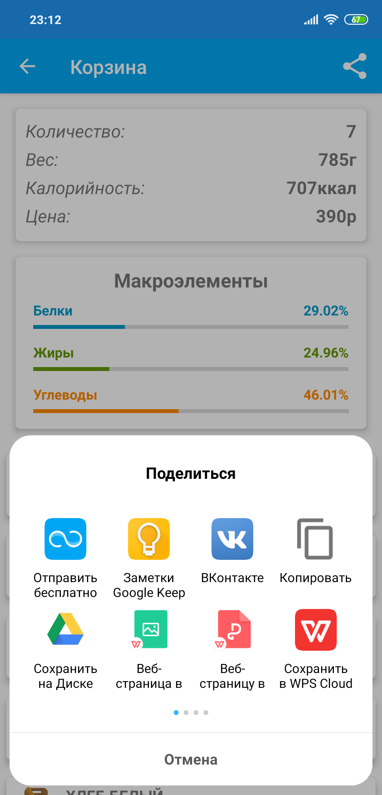
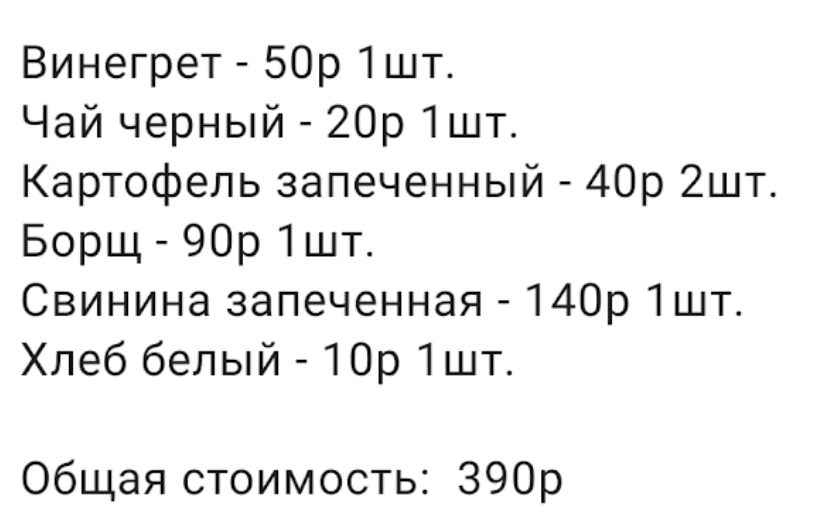
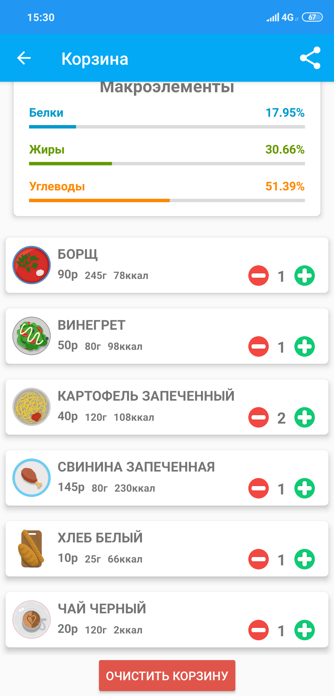

# Canteen
Проект разработан в рамках участия в "Best Hack 2019".

Демо ролик <a href="https://youtu.be/EWTG85y44hM">здесь</a>

Помимо основного задания были выполнены все дополнительные:

* Добавлена возможность просмотра калорийности блюда, количества макроэлементов и суммарная калорийность блюд
* Добавлен функционал выбора других столовых
* Добавлена информация о режиме работы столовых и их меню на каждый день

Более подробную информацию о работе каждой функции можно посмотреть ниже в разделе "Быстрый старт".

## Для пользователя
Спасибо, что уделили внимание нашему проекту!
>**Обратите внимание!**
>Данный проект разрабатывался в рамках мероприятия "Best Hack 2019" и предоставляется в пользование исключительно в ознакомительных целях.
>Полное лицензионное соглашение можно прочитать <a href="https://github.com/Shaniser/Canteen/tree/master/license agreement(RUS)">здесь.</a>

## Установка
1. Скачайте .apk файл данного приложения <a href="https://github.com/Shaniser/Canteen/blob/master/builds/canteen%201.4.apk">здесь</a>
2. Следуйте дальнейшим инструкциям при установке

### Команда разработчиков
* Алексей Костюченко,   [ВК](https://vk.com/shaniser)
* Михаил Соколовский,   [ВК](https://vk.com/sokolmish)
* Илья Щербаков,   [ВК](https://vk.com/ylyxa)
* Илья Каркин,   [ВК](https://vk.com/id210438588)

## Содержание прокета
<ul>
    <li><a href="https://github.com/Shaniser/Canteen/tree/master/app/src/main/java/com/godelsoft/canteen">Основные классы</a>
        <ul>
            <li><a href="https://github.com/Shaniser/Canteen/blob/master/app/src/main/java/com/godelsoft/canteen/MainActivity.java">MainActivity</a> - Точка входа в приложение</li>
            <li><a href="https://github.com/Shaniser/Canteen/blob/master/app/src/main/java/com/godelsoft/canteen/Food.java">Food</a> - Класс блюда</li>
            <li><a href="https://github.com/Shaniser/Canteen/blob/master/app/src/main/java/com/godelsoft/canteen/CanteenLoader.java">CanteenLoader</a> - Класс получения данных о столовых и их меню</li>
            <li><a href="https://github.com/Shaniser/Canteen/blob/master/app/src/main/java/com/godelsoft/canteen/CanteenProvider.java">CanteenProvider</a> - Класс, предоставляющий информацию о столовой и меню</li>
            <li><a href="https://github.com/Shaniser/Canteen/blob/master/app/src/main/java/com/godelsoft/canteen/Basket.java">Basket</a> - Класс корзины</li>
        </ul></li>
    <li><a href="https://github.com/Shaniser/Canteen/tree/master/app/src/main/res">Ресурсы приложения</a></li>
    <li><a href="https://github.com/Shaniser/Canteen/tree/master/app/src/main/assets/menus">Данные столовых и меню</a></li>
    <li><a href="https://github.com/Shaniser/Canteen/blob/master/dishes.txt">Список используемых блюд</a></li>
</ul>

## Структура хранения информации о столовых
Вся информация об одной столовой содержится в одном текстовом файле, находящемся в папке <a href="https://github.com/Shaniser/Canteen/tree/master/app/src/main/assets/menus">/assets/menus</a>. 
Названия всех таких файлов должны быть перечислены в <a href="https://github.com/Shaniser/Canteen/blob/master/app/src/main/assets/canteensList.txt">/assets/canteensList.txt</a> по одному файлу на строку. 
В связи с тем, что вся информация хранится в текстовом виде, допускается быстрый переход на другие способы хранения и получения этой информации, в том числе - загрузка с сервера.
<ul>
    <li><a href="https://github.com/Shaniser/Canteen/blob/master/canteenExample.txt">Пример оформления файла с информацией о столовой с комментариями</a> (В рабочем файле комментарии не допускаются)</li>
    <li><a href="https://github.com/Shaniser/Canteen/blob/master/dishes.txt">Пример оформления информации о блюдах</a></li>
</ul>

## Быстрый старт
**После установки и запуска приложения перед вами будет список столовых.**
>Нажмите на столовую, чтобы выбрать ее

**После выбора столовой перед вами откроется меню столовой.**

* В верхней части экрана находится расписание
* В средней части экрана находятся фильтры выбора блюд
>Выберете пункт во всплывающем меню, чтобы применить фильтр

* В нижней части экрана находится меню столовой

**Выберете интересующее блюдо из меню**
>Для того, чтобы посмотреть подробную информацию о блюде, нажмте на него

**Вы можете добавить блюдо в корзину, нажав на кнопку "+"**
>Чтобы регулировать количество порций используйте "+" и "-"

**В корзине вы можете еще раз посмотреть информацию о выбранных вами блюдах, изменить количество порций и узнать итоговую цену**
>Нажмите на изображение корзины в правом верхнем углу, чтобы перейти в корзину

**Вы можете отправить список покупок**
>Нажмите на кнопку "Поделиться" в правом верхнем углу, чтобы отправить список покупок

>Сообщение будет выглядеть примерно так:
>
>

**Чтобы сразу очистить всю корзину нажмите "очистить корзину"**

#### Надеемся, что вам понравится наше приложение!
